<h3 align="center">cakbaskara@github ~ $ whoami</h3>

<table align="center">
  <tr>
    <td></td>
    <td></td>
  </tr>
</table>

  

 

<h3 align="center">Kalau tidak suka garis tabelnya, ganti blok tabel di atas dengan ini:</h3>

<!--

  

-->
